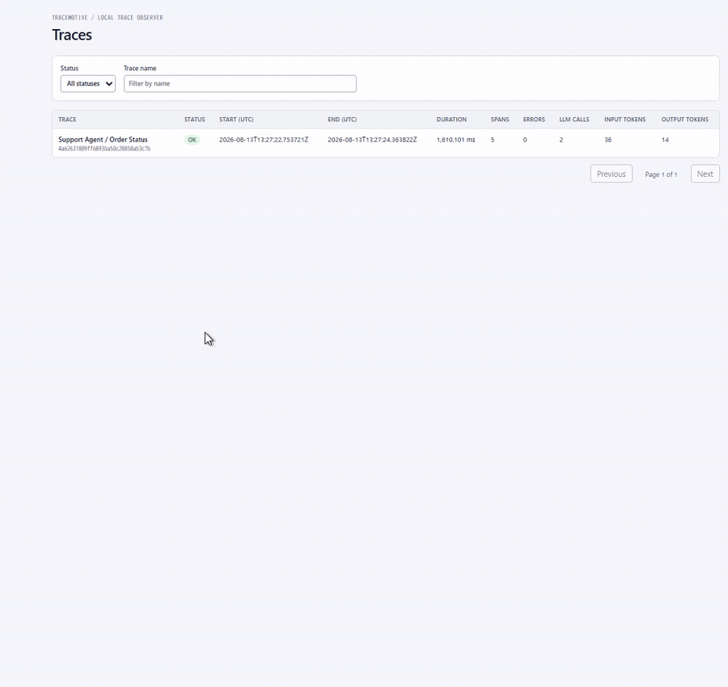

# TraceMotive

When an AI agent succeeds once and fails once, the difficult question is often
not “did the runs differ?” but “where is the first difference that the evidence
actually supports investigating?”

TraceMotive compares AI agent executions and shows where their observed
behavior first diverges with enough evidence to support an investigation
starting point. It runs locally, keeps the Collector and SQLite data on the
machine, and presents uncertainty when the evidence cannot support a narrower
claim.

TraceMotive does **not** claim that an observed divergence caused a later
failure. It does not provide automatic RCA, replay, cloud observability,
authentication, remote collectors, or broad framework support.



## Try it locally in about three minutes

This is the normal installed-user path. It uses a deterministic local pair, so
it needs no model provider, API key, Node.js, npm, cloud service, or external
network request.

In the first terminal, install the server extra and start the loopback server:

```text
python -m pip install "tracemotive[server]"
tracemotive serve
```

`tracemotive serve` binds to `127.0.0.1:8765` and serves the packaged UI and
APIs. Keep this terminal running.

In a second terminal, seed the stable identified example:

```text
tracemotive demo
```

Open the printed comparison URL. In the comparison, use the compact workflow:

- **Look here** — the first evidence-supported investigation starting point;
- **What changed** — the best supported behavioral description;
- **Later observations** — additional supported behavioral observations, when a safe compact subset exists;
- **Evidence** — captured observations, limitations, and left/right/full-comparison actions; and
- **What TraceMotive does not know** — the boundary between observation and
  explanation.

To see the uncertainty barrier for repeated members, run this in the second
terminal instead:

```text
tracemotive demo --scenario uncertain
```

Each invocation creates a fresh pair and leaves existing traces in place. The
default demo is identified; the uncertain demo keeps repeated members
unpaired when the evidence cannot establish their identity.

## What the comparison means

TraceMotive reports observed evidence, not a diagnosis. A selected starting
point means that the comparison found a supported place to begin investigating;
it does not mean that TraceMotive knows the cause of a later failure.

The structured diff is deliberately conservative. It compares object keys in a
deterministic order and emits bounded `add`, `remove`, and `replace` records at
JSON Pointer paths. Arrays do not receive inferred identity or move semantics;
complex arrays may fall back to a whole-array replacement. If capture is
unavailable or redaction prevents a safe comparison, TraceMotive does not
invent a detailed diff.

## Evaluation scope

The public evaluation claim is limited to the current **V03-10 adversarial
corpus**. In that 30-scenario corpus:

- 30 scenarios are mandatory;
- 15 have an expected confident meaningful-divergence answer;
- 14 have an expected supported investigation starting point;
- the false-confident meaningful-divergence target/result for a conforming
  outcome set is 0; and
- the false-confident investigation-starting-point target/result for a
  conforming outcome set is 0.

The corpus is intended to exercise ambiguity, incomplete traces,
capture/redaction barriers, repeated tools, context-only changes, and
structural divergence ordering. These are corpus-scoped oracle facts, not a
universal accuracy guarantee, confidence percentage, causal claim, or
independent benchmark.

The reproducible oracle checks are:

```text
python -m unittest tests.test_divergence_evaluation -v
python -m tests.divergence_evaluation
```

The full report is [the v0.3 divergence evaluation](docs/divergence-evaluation-v0.3.md).

## Supported integration

The validated framework integration is the public OpenAI Agents SDK adapter.
The tested support range is `openai-agents>=0.17,<0.18`, with compatibility
checks at versions `0.17.0`, `0.17.4`, and `0.17.8` for the adapter callbacks,
span-data fields, processor registration, model settings, and example
construction surface.

Install it separately when you want to instrument a real agent. This is the
normal installed-user path; it does not require a repository checkout:

```text
python -m pip install "tracemotive[openai-agents]"
```

With the Collector already running, use the public integration API:

```python
import tracemotive
from tracemotive.integrations.openai_agents import install

tracemotive.configure(
    enabled=True,
    endpoint="http://127.0.0.1:8765",
    capture_content=False,
)
install(local_only=True)
```

`local_only=True` makes TraceMotive the only OpenAI Agents tracing processor in
that process. It controls framework tracing processors; it does not make model
traffic local. A provider request may still leave the machine.

Generic Python support is manual instrumentation through the public
`configure`, `trace`, `span`, and `flush` SDK. It is not an automatic
framework adapter.

LangGraph is not currently supported.

See the [OpenAI Agents integration notes](docs/openai-agents.md) for the
installed-user path. The [example README](examples/README.md) is
source-checkout documentation only.

## Install a released package

The current package version is `0.5.0`. For a normal installation:

```text
python -m pip install tracemotive
```

For the local Collector and packaged UI:

```text
python -m pip install "tracemotive[server]"
```

Normal installed users do not install Node.js, run npm, or run the repository
bootstrap script.

## Contributor setup from a fresh checkout

Contributor setup is separate from the installed-user path. Create and
activate a virtual environment, install development dependencies, and then
run the one canonical repository bootstrap command.

PowerShell:

```powershell
python -m venv .venv
.venv\Scripts\Activate.ps1
python -m pip install --upgrade pip
python -m pip install "setuptools>=77,<84" wheel build
python -m pip install -e ".[server]"
python scripts/bootstrap.py
```

POSIX shells:

```sh
python3 -m venv .venv
. .venv/bin/activate
python -m pip install --upgrade pip
python -m pip install "setuptools>=77,<84" wheel build
python -m pip install -e ".[server]"
python scripts/bootstrap.py
```

`python scripts/bootstrap.py` runs the locked frontend install and package
build from the repository root. It writes only disposable ignored generated UI
assets. The development frontend is optional:

```text
cd frontend
npm run dev
```

The production UI is embedded in the Python package and served by
`tracemotive serve`; Node.js is not a runtime requirement for installed users.

For a maintainer-only direct Uvicorn factory check, the equivalent loopback
command is:

```text
python -m uvicorn tracemotive.collector:create_app --factory --host 127.0.0.1 --port 8765
```

## Local SDK usage

TraceMotive and content capture are independently disabled by default. A
minimal local trace is:

```python
import tracemotive

tracemotive.configure(
    enabled=True,
    endpoint="http://127.0.0.1:8765",
    capture_content=False,
)

with tracemotive.trace("demo"):
    with tracemotive.span("work"):
        pass

tracemotive.flush()
```

The stable SDK surface remains `configure`, `trace`, `span`, and `flush`.
Tracing failures, an unavailable Collector, and queue overflow do not fail the
instrumented Agent execution.

## Current support, limits, and storage

TraceMotive is intended for local individual debugging.

- Python `>=3.10` is declared; CI currently validates Python `3.10` and `3.12`.
- The validated native integration is OpenAI Agents SDK `>=0.17,<0.18`.
- Generic Python support is the public `configure`, `trace`, `span`, and `flush` API.
- LangGraph is not currently supported.
- Installed users do not need Node.js.
- Per-comparison bounds are `10,000` spans/side, `4,096` difference records, and `4 MiB`.
- Exceeding a comparison bound fails the comparison; structured-diff bounds truncate the projection.
- `tracemotive serve` stores a local SQLite file unless `--db` or `TRACEMOTIVE_DB` is set.
- File-backed databases have no automatic retention and persist until records are deleted or the unused file is intentionally removed. The default programmatic Collector is `:memory:` and does not persist across process termination.
- One trace can be deleted with `DELETE /api/v1/traces/{trace_id}`.
- Loopback is not authentication.

Details: [compatibility](docs/compatibility.md), [limits](docs/limits.md), [storage](docs/storage.md), and [security model](docs/security-model.md).

## Privacy and security boundary

- TraceMotive is disabled by default and includes no analytics or external
  TraceMotive telemetry.
- Content capture is independently disabled by default.
- The supported Collector transport is loopback-only.
- Framework adapters convert data into Canonical values before the shared
  privacy boundary redacts and sanitizes values before transport queue
  ownership.
- The Collector persists sanitized Canonical-derived data in local SQLite.
- Captured runtime content is untrusted data. The frontend renders it as data
  and does not execute embedded HTML, script, or arbitrary code.
- Tracing and sink failures remain isolated from the user's Agent execution.
- Provider traffic, such as an OpenAI model request, is separate from
  TraceMotive telemetry and may leave the machine.

Do not treat these statements as a formal security audit. Loopback is not
authentication. For the local-first threat model, storage locations, and
redaction limits, read [docs/security-model.md](docs/security-model.md). For
sensitive reports, read [SECURITY.md](SECURITY.md) and use GitHub Private
Vulnerability Reporting rather than a public issue.

## Compatibility and documentation layers

The repository intentionally keeps these layers separate:

| Layer | Meaning |
|---|---|
| `spec/v0.1-frozen-spec.md` | Historical Frozen compatibility contract for Canonical schema, ingest, privacy, transport, and v1 behavior. It remains authoritative and unchanged. |
| `spec/v0.2-proposed-spec.md` and `spec/v0.3-proposed-spec.md` | Historical proposed design documents; they are not permission to rewrite the v0.1 contract. |
| Package metadata | `0.5.0` distribution version; not a Canonical schema, ingest protocol, or automatic API version trigger. |
| Canonical and ingest | Canonical schema `0.1`; ingest protocol `1`. |
| Query APIs | TraceMotive currently exposes `/api/v1`, `/api/v2`, `/api/v3`, and `/api/v4`. `/api/v3` provides the investigation comparison surface, and `/api/v4/compare/{left}/{right}` provides the structured-diff projection. |
| `docs/v0.4/` | Frozen-for-implementation v0.4 design and release requirements; it is not itself a package-version or release declaration. |

The v0.4 API v3/v4 decision is contract-driven. `/api/v3` remains unchanged.
`/api/v4` is needed because bounded operation diff records, explicit no-diff
capture semantics, conservative array fallback, and cockpit action targets
cannot be added to the existing v3 response without changing that contract.
This is not API versioning caused by the package number.

## Local validation

Python tests:

```text
python -m unittest discover -s tests -v
```

Frontend tests and production build:

```text
python scripts/bootstrap.py
cd frontend
npm test
npm run build
```

Packaging and installed-user checks are maintainer validation documented in
the [historical release-readiness checklist](docs/release-readiness.md). They
are separate from the normal installed-user quickstart.

## Contributing

Read [CONTRIBUTING.md](CONTRIBUTING.md) before making changes. Keep changes
within the current v0.4 Core scope while preserving the Frozen v0.1 contract.
Do not infer support for deferred or conditional features from the long-term
vision or from a passing unit test with a fake framework object.

## Security

Do not report security vulnerabilities in public Issues or pull requests.
Read [SECURITY.md](SECURITY.md) and use GitHub Private Vulnerability Reporting
from the repository Security page.
