# TraceMotive v0.4 architecture

Status: final implementation architecture. It is deliberately additive to
the current v0.3 runtime and does not authorize production changes.

## 1. Architecture boundary

```mermaid
flowchart TD
    F[Framework runtime] --> A[Integration adapter]
    A --> C[Canonical schema 0.1]
    C --> T[Bounded local transport]
    T --> L[Loopback collector]
    L --> S[SQLite backend]
    S --> Q[Query API v1 v2 v3 v4]
    Q --> U[UI investigation cockpit]
    B[Frontend build/package bootstrap] --> U
```



The framework boundary and SQLite boundary do not move:

- Framework objects stop at an adapter.
- Canonical events remain the only shared observation shape.
- Redaction and content capture policy run before queue ownership.
- SQLite stores sanitized Canonical-derived data, not framework objects.
- The UI consumes Query API responses only.
- Build tooling produces packaged static assets but is not part of runtime
  tracing.

## 2. Additive v0.4 data flow

The v4 investigation route composes existing persisted Canonical snapshots and
the existing v2/v3 comparison engines:

```text
GET /api/v4/compare/{left}/{right}
  -> validate trace ids
  -> one read-only snapshot per trace
  -> existing deterministic alignment/divergence/finding composition
  -> project bounded v2 field differences into v4 structured-diff entries
  -> attach only valid local actions
  -> validate response size and JSON shape
```

The route must not mutate trace state, update timestamps, fetch a framework
object, call an LLM, call a remote service, or read a clipboard.

## 3. API version decision and v4 read-model contract

The package version is not an API-version trigger. The design decision is to
keep `/api/v3/compare` byte and semantically stable and add v4 because the Core
proposal introduces a materially new response contract: operation-based bounded
diff records, explicit no-diff capture semantics, conservative array fallback,
and cockpit action targets. Composing unchanged v3 with the existing v2 detail
response would not provide those bounds and capture semantics without changing
an existing contract. Existing v3 consumers must not be forced to parse v4
fields.

The additive route is therefore:

```text
GET /api/v4/compare/{left}/{right}
```

The exact production schema should be encoded in a dedicated API module and
contract tests. The design shape is:

```json
{
  "comparison_version": "0.4",
  "left": {"trace_id": "...", "name": "...", "status": "..."},
  "right": {"trace_id": "...", "name": "...", "status": "..."},
  "summary": {
    "alignment_state": "complete",
    "investigation_state": "identified",
    "last_reliably_matched_point": {
      "trace_id": "...",
      "span_id": "...",
      "coordinate": "root/agent/tool"
    }
  },
  "investigation": {
    "primary_finding_id": "finding-1",
    "finding_ids": ["finding-1", "finding-2"],
    "uncertainty_ids": [],
    "actions": [
      {"type": "open_left", "target": {"trace_id": "...", "span_id": "..."}},
      {"type": "open_right", "target": {"trace_id": "...", "span_id": "..."}},
      {"type": "full_comparison", "target": {"hash": "#/compare/.../..."}},
      {"type": "copy_local_reference", "target": {"hash": "#/compare/.../..."}}
    ]
  },
  "findings": [
    {
      "id": "finding-1",
      "scope": "behavioral",
      "observation_state": "confirmed",
      "reason_code": "tool_input_changed",
      "field_path": "/input",
      "observed": {"left": "...", "right": "..."},
      "evidence": {"path": "/input/allowed_statuses/0"},
      "structured_diff": [
        {
          "op": "replace",
          "path": "/input/allowed_statuses/0",
          "left": {"state": "present", "value": "paid"},
          "right": {"state": "present", "value": "settled"},
          "reason": null
        }
      ],
      "structured_diff_truncated": false,
      "relationships": {"supports": [], "limited_by": []},
      "actions": [
        {"type": "copy_evidence", "target": {"finding_id": "finding-1"}}
      ]
    }
  ],
  "uncertainties": []
}
```

The following rules are normative for implementation:

- Existing v3 fields retain their meaning. v4 adds the structured diff and
  local action fields; it must not reinterpret v3 as causal or diagnostic.
- Every `structured_diff` entry has an operation `op`, a JSON Pointer `path`, an
  explicit observation wrapper for each side, and either a reason or JSON
  `null`. Operations are `add`, `remove`, and `replace`.
- Observation wrapper states are `present`, `absent`, `unavailable`, and
  `redacted`. A present JSON `null` is represented as `{"state":"present",
  "value":null}` and is never confused with absence.
- If either side of the compared field is capture-unavailable or redacted, no
  structured diff entry is emitted for that field. The finding retains an
  explicit limitation/uncertainty reason instead. No diff is treated as
  equality or as proof of no change.
- `unavailable` and `redacted` wrappers carry no untrusted raw value. A
  redaction marker may be displayed only if it was already produced by the
  privacy layer.
- Equal values are omitted from the diff. A diff contains only `add`, `remove`,
  and `replace` records.
- `copy_evidence` copies only the already-sanitized response projection and
  includes the comparison IDs, finding ID, field path, and diff entries. It
  never copies a framework object, API key, raw transport body, or remote URL.
- `copy_local_reference` copies a hash-only local route. It does not create a
  share token, upload evidence, or construct a remote link.
- Actions are omitted when their target is unavailable or ambiguous. An action
  must never point at a guessed repeated sibling.

## 4. Conservative structured diff projection

The v4 projection reuses the existing alignment and privacy barriers but defines
a narrower diff contract than the current v2 presentation. It is not a new
pairing algorithm.

Required ordering and limits:

1. Span coordinates are ordered by the existing structural ordering.
2. Object keys are compared in sorted order and paths use escaped JSON Pointer
   bytes.
3. Object differences are `add`, `remove`, or `replace` at the narrowest safe
   object path.
4. Scalar arrays MAY use index-only `add`, `remove`, and `replace` records. An
   index is a position, never an inferred identity; the implementation MUST NOT
   infer moves or pair elements by similarity, timestamp, or chronology.
5. Arrays containing objects or nested/heterogeneous values MUST NOT receive
   identity-based element alignment. When an element-level view could mislead,
   the implementation MAY emit one bounded whole-array `replace` at the array
   path. If the whole array cannot fit the bounds, emit no values and mark the
   diff truncated with a limitation reason.
6. If capture is unavailable or redacted on either side of a field, emit no diff
   records for that field and retain the uncertainty/limitation reason.
7. The v4 projection has explicit bounds: maximum diff depth 32, maximum
   visited diff nodes 4096, maximum change records 256 per finding, and the
   existing aggregate response-size limit. These are projection limits, not
   Canonical schema limits.
8. On any bound, return deterministic records collected before the bound and set
   `structured_diff_truncated: true` with a stable reason. Never serialize the
   unvisited subtree merely to explain the bound.
9. Use iterative traversal or an equivalent recursion-safe implementation.
10. Repeated sibling groups remain `ambiguous_group`; v4 cannot make them
    addressable by ordinal or timestamp.

No field name, path depth, list index, string length, timing value, or value
similarity may be used to infer importance, confidence, or causality.

## 5. Minimal cockpit and local navigation model

The UI router adds only local hash routes:

- `#/traces/{trace_id}`: trace detail.
- `#/traces/{trace_id}/spans/{span_id}`: trace detail with a selected span.
- `#/compare/{left_trace_id}/{right_trace_id}`: comparison cockpit.

IDs are validated by the API and client route parser. Route segments are
encoded/decoded as data, not interpreted as filesystem paths or HTML. The span
detail route must tolerate a missing/deleted span with an explicit not-found
state and no fallback to a different span.

The cockpit contains only five sections:

- `Look here`;
- `What changed`;
- `Evidence`;
- `Next`; and
- `What TraceMotive does not know`.

The primary actions are exactly `Open left span`, `Open right span`, and `Full
comparison`. Copy evidence and copy local reference are secondary actions. The
screen MUST remain a focused investigation surface, not a dashboard with
rankings, metrics, or unrelated panels.

The comparison view may retain a compact left/right selection control, but it
must not become a metadata explorer. It contains a neutral comparison summary,
the bounded structured diff viewer, and the five sections above. Any additional
behavioral/context detail is nested under those sections rather than adding new
dashboard cards.

Selection state is UI state. It is not added to Canonical trace or span models,
and it is not persisted as trace metadata.

## 6. Onboarding and demo architecture

The empty state is static, deterministic content backed by existing local
commands. It provides:

- `tracemotive serve` to start the loopback server;
- `tracemotive demo` for the stable default pair; and
- a copyable actual-agent instrumentation example using the public OpenAI
  Agents wiring.

The Core requires two small deterministic scenarios: one identified observation
and one uncertainty barrier. A broader catalog, including a none/identical
scenario, is optional only if cheap and bounded. Demo seeding uses the existing
local loopback health check and does not probe or require an API key. The browser
does not spawn a process.

## 7. Build and packaging architecture

Add one tracked repository bootstrap entry point, implemented as a small
cross-platform wrapper around `npm ci` and `npm run build:package`. It must:

- locate `npm.cmd` on Windows and `npm` elsewhere;
- run from the repository root while targeting `frontend`;
- report which prerequisite failed;
- preserve the current generated-asset copy behavior;
- not modify source files other than ignored generated UI assets; and
- be the exact command used by README, CONTRIBUTING, CI, and fresh-checkout
  tests.

The packaging E2E must create its source from tracked files or `git archive`,
not from the working tree. The installed-wheel phase must run outside the
checkout and prove that Node, `frontend/dist`, and the source checkout are not
required at runtime.

## 8. Integration architecture

### OpenAI Agents

Keep the current public-API adapter and its current capture/privacy behavior.
Test the documented checkpoint matrix before changing the support range. The
adapter may retain approved model/request parameters as sanitized `LLMDetails`
fields; it must not capture arbitrary framework objects or provider secrets.

### LangGraph (Conditional v0.4)

Implement only if the full C-V04-09 GO gate passes. The adapter should map graph
run, node/tool, and model boundaries to existing Canonical span types, with
explicit unavailable capture states. It must not serialize graph state
wholesale, infer causal edges, or require a hosted LangGraph service. If any GO
condition fails, defer the adapter to v0.4.1 and remove the v0.4 support claim.

### OpenTelemetry

Do not add an exporter in v0.4. Document a future mapping at the Query/API edge
or adapter boundary, not by importing OTel span objects into Canonical. Preserve
the current exclusions for distributed tracing, span links, and remote export.

## 9. Threat model and controls

| Threat | Control |
|---|---|
| Hostile captured HTML/script | JSON/text-only rendering; no `innerHTML`, markdown execution, or dynamic HTML component. |
| Secret in captured value or query error | Existing pre-queue sanitizer; safe error fields; no raw value echo; copy only sanitized response data. |
| Path traversal through asset or route values | Existing asset traversal checks; route values are IDs, never filesystem paths; test encoded separators and NUL. |
| Oversized/deep JSON diff | Existing size/record bounds; iterative traversal; explicit truncation; response-size validation. |
| Ambiguous repeated spans | Preserve `ambiguous_group`; omit target actions; no ordinal pairing. |
| Clipboard exfiltration | Copy only local sanitized evidence or hash-only route; show visible text fallback; no remote upload. |
| Localhost exposure | Keep loopback-only serve behavior and reject non-loopback binding. |
| SQLite corruption or migration surprise | No v0.4 migration unless necessary; use read-only comparison transactions; retain startup refusal for newer/invalid DB. |
| Dependency supply-chain drift | Pin/record tested frontend and adapter matrices in CI/release evidence; inspect lockfiles and package metadata. |
| Adapter failure affects agent | Keep callback mapping and sink failures isolated from user execution. |

## 10. Planned file boundaries

Likely implementation touch points are:

- `scripts/` and root documentation for the build bootstrap;
- `tracemotive/api_v4.py` and `tracemotive/query.py` for the additive route;
- `tracemotive/comparison.py` only if a projection helper is required, without
  altering v2 semantics;
- `frontend/src/api.ts`, `types.ts`, `app.tsx`, `trace-list.tsx`,
  `trace-comparison.tsx`, `comparison-insight.tsx`, and `trace-detail.tsx`;
- `tracemotive/demo.py` and CLI tests for the two Core scenarios;
- a separate optional adapter module and dependency metadata only if the full
  Conditional LangGraph GO gate passes; and
- tests, README, CONTRIBUTING, CI, SECURITY, and release evidence documents.

No Canonical model, transport protocol, storage table, or v1/v2/v3 contract is a
default v0.4 touch point.
