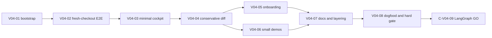

# TraceMotive v0.4 issue plan

Status: final implementation-ready plan. Product
priority is cockpit > structured diff > onboarding > demo breadth > ecosystem
expansion. Bootstrap/E2E are prerequisites; dependency order may put the diff
contract immediately before cockpit evidence integration.

## 1. Delivery order

## 2. Issues

### V04-01 — one fresh-checkout frontend bootstrap path

Priority: P0. Depends on: none.

Likely files:

- new tracked root/bootstrap script under `scripts/`;
- `frontend/package.json` only if the existing command needs a stable wrapper;
- `.github/workflows/ci.yml`;
- `README.md`, `CONTRIBUTING.md`.

Acceptance criteria:

- One documented cross-platform command runs `npm ci` and the existing
  `npm run build:package` from a clean tracked checkout.
- Windows uses `npm.cmd` when required; non-Windows uses `npm`.
- Missing Node, failed dependency install, failed TypeScript build, and missing
  `frontend/dist/index.html` produce actionable errors.
- The command writes only the intended ignored generated UI assets.
- CI, README, CONTRIBUTING, and the fresh-checkout test call the same entry
  point, not four subtly different sequences.

Tests and security:

- unit-test command resolution and failure messages without network access;
- run it from a path containing spaces;
- verify generated output contains the packaged index and JS/CSS assets;
- verify no source or credential file is copied into the package; and
- test that a malicious asset filename cannot escape the package destination.

Rollback: remove the wrapper and its CI/docs references; leave the current
frontend build and runtime package behavior untouched. Do not roll back or alter
Canonical/API code as part of this issue.

### V04-02 — tracked-file-only packaging and installed full-stack smoke

Priority: P0. Depends on: V04-01.

Likely files:

- `tests/test_packaging.py`;
- new `tests/test_fresh_checkout_e2e.py` or equivalent;
- `scripts/package_frontend.py` only for narrowly required diagnostics;
- release documentation.

Acceptance criteria:

- The test source is produced from `git archive`, an allowlisted tracked-file
  copy, or an equivalent clean checkout. It MUST exclude ignored
  `frontend/dist` and `tracemotive/ui/index.html`.
- The test runs install -> bootstrap -> build artifact -> install wheel outside
  the checkout -> `serve` -> demo seed -> v1/v2/v3/v4 query -> packaged UI.
- The installed runtime works without Node, frontend sources, or the source
  checkout.
- The test proves persistent restart and comparison behavior, not only HTTP 200.

Tests and security:

- run in a network-permitted isolated environment with the declared extras;
- validate wheel contents and hashes;
- verify loopback-only binding and rejection of remote hosts;
- verify traversal, missing asset, malformed JSON, and oversized request paths;
- prove no raw secret appears in artifact files, SQLite, or failure output.

Rollback: restore the existing packaging tests only if the new test is blocked
by environment, but keep the gap marked release-blocking. Do not weaken the
test by copying ignored generated assets.

### V04-03 — minimal investigation cockpit and navigation

Priority: P0 and highest product priority. Depends on: V04-02 for the clean
runtime path; it may start with existing v3/v2 responses while V04-04 finalizes
the structured diff contract.

Likely files:

- `frontend/src/app.tsx`;
- `frontend/src/trace-detail.tsx`;
- `frontend/src/trace-comparison.tsx`;
- `frontend/src/comparison-insight.tsx`;
- `frontend/src/api.ts`, `frontend/src/types.ts`;
- frontend route/action tests.

Acceptance criteria:

- Implement `#/traces/{trace}`, `#/traces/{trace}/spans/{span}`, and
  `#/compare/{left}/{right}`.
- Keep exactly five named sections: `Look here`, `What changed`, `Evidence`,
  `Next`, and `What TraceMotive does not know`.
- Provide exactly three primary actions: `Open left span`, `Open right span`,
  and `Full comparison`.
- Keep copy evidence/link secondary, with a visible text fallback when
  clipboard access fails.
- Keep a compact left/right selection control and restore the comparison after
  navigation without adding dashboard panels, ranking, or arbitrary metadata.

Tests and security:

- route parsing with encoded IDs, invalid IDs, missing targets, and traversal
  strings;
- action omission for ambiguous/missing targets;
- XSS payloads in names, values, paths, and reason codes;
- clipboard denial and local-hash-only assertions; and
- keyboard/accessibility navigation for the evidence sections.

Rollback: remove the cockpit controls/routes; retain the existing v3 comparison
screen and v2 detail view. Do not change stored trace data.

### V04-04 — conservative structured JSON diff

Priority: P0 and second product priority. Depends on: V04-03 for the evidence
surface and V04-02 for release integration.

Likely files:

- `tracemotive/comparison.py`, `tracemotive/divergence.py`, and/or
  `tracemotive/findings.py` only for narrowly scoped projection reuse;
- `tracemotive/query.py` and new `tracemotive/api_v4.py` under the documented
  v4 response-contract decision;
- `frontend/src/api.ts`, `frontend/src/types.ts`;
- new API/comparison adversarial tests.

Acceptance criteria:

- Implement `/api/v4/compare/{left}/{right}` under the documented decision:
  unchanged v3 plus the existing detail route cannot provide the required
  operation diff, bounds, no-diff capture semantics, and array fallback. Do not
  version the API merely because the package is 0.4.
- Use deterministic object-key comparison, escaped JSON Pointer paths, and only
  `add`, `remove`, and `replace` records.
- Bound maximum depth 32, visited nodes 4096, change records 256 per finding,
  and the existing aggregate response-size limit.
- Emit no diff for capture-unavailable or redacted fields; retain an explicit
  uncertainty/limitation reason instead.
- Arrays MUST NOT infer identity or moves. Scalar arrays may use index-only
  records; complex arrays may fall back to one bounded whole-array replacement.
- Never infer semantic importance, confidence, or causality.

Tests and security:

- deterministic object-key ordering and JSON Pointer escaping;
- add/remove/replace cases, null versus absent, depth/node/change bounds;
- scalar-array index cases, complex-array whole-array fallback, and reorder cases;
- capture-unavailable/redacted no-diff cases with retained uncertainty;
- repeated sibling ambiguity never receives a member target;
- hostile strings remain inert JSON/text and response-size truncation is explicit.

Rollback: remove only the new projection/route. Keep v3 composition and v2
comparison untouched; v1/v2/v3 remain the fallback surface.

### V04-05 — API-key-free empty-state onboarding

Priority: P0. Depends on: V04-01 for exact command text.

Likely files:

- `frontend/src/trace-list.tsx` and a small onboarding component;
- `frontend/src/types.ts` only if static action types need typing;
- frontend tests and README snippets.

Acceptance criteria:

- Empty state contains visible copyable commands for server, default demo, and
  actual-agent instrumentation.
- It clearly distinguishes TraceMotive's local API-key-free demo from a user's
  optional provider API key.
- The browser never spawns a command, probes a key, or sends data externally.
- Clipboard failure leaves a selectable command block.

Tests and security: no-key render test, hostile command/text render test,
clipboard denial test, keyboard focus test, and assertions that no fetch is
made except the existing local trace-list request.

Rollback: restore the existing empty-state copy; keep the build/bootstrap
documentation and local CLI behavior unchanged.

### V04-06 — small realistic deterministic demo coverage

Priority: P0 but below cockpit, diff, and onboarding. Depends on: V04-03,
V04-04, and V04-05.

Likely files:

- `tracemotive/demo.py`, `tracemotive/cli.py`;
- README/demo docs;
- `tests/test_demo.py` and scenario fixtures.

Acceptance criteria:

- Existing default demo behavior remains stable.
- Explicit scenarios cover an identified behavioral difference and an uncertain
  barrier. A none/identical scenario or broader catalog is optional only if
  cheap and bounded.
- Each scenario is local-only, realistic, sanitized, repeatable, and has an
  exact expected state assertion.
- Repeated seeding does not delete existing traces or require a provider key.

Tests and security: fresh-process repeatability, response identity, loopback
endpoint validation, no external call, API-key non-probing, hostile values, and
scenario-specific expected v3/v4 state according to the API decision.

Rollback: keep the existing default pair and remove only extra scenario names;
do not change the existing demo endpoint safety checks. Demo breadth must not
delay cockpit or structured diff.

### V04-07 — README, evaluation, and specification layering

Priority: P0. Depends on: V04-01 through V04-06. Conditional LangGraph wording
is added only if C-V04-09 passes.

Likely files:

- `README.md`, `CONTRIBUTING.md`, `SECURITY.md`;
- `docs/divergence-evaluation-v0.3.md` or a new v0.4 evaluation document;
- `docs/v0.4/` layering references;
- release/provenance documentation. Package metadata is only a future,
  separately authorized change.

Acceptance criteria:

- First 30 seconds follow problem -> example -> local demo -> integrations ->
  safety -> evaluation -> limits -> architecture.
- Current numbers are labeled with the 30-scenario corpus/version and state the
  exact 15/14/0/0 facts; no universal accuracy or causal claim appears.
- Frozen v0.1, proposed v0.2/v0.3 history, and frozen-for-implementation v0.4
  labels are consistent. The v0.4 design does not rewrite historical specs.
- The API v3/v4 decision and its exact response-contract justification are
  documented.
- Maintainer identity/provenance remains explicitly pending unless separately
  verified; no personal identity is invented.

Tests and security: documentation link/command checks, grep for forbidden causal
claims and stale version promises, package metadata inspection, and security
contact/provenance checklist.

Rollback: revert documentation changes independently; never rewrite historical
specs or change version strings mechanically.

### V04-08 — maintainer dogfood, adversarial release gate, and scorecard closure

Priority: P0. Depends on V04-07 and all Core issues. Conditional LangGraph is
judged separately by C-V04-09.

Likely files:

- `docs/v0.4/v0.4-release-gate.md`;
- `docs/v0.4/v0.4-review-scorecard.md`;
- new maintainer-only dogfood fixtures/test entry under `tests/`;
- test matrix/CI configuration only as needed to make gates executable.

Acceptance criteria:

- Every review unit has a material closure, explicit safe rejection, or named
  deferral with owner and follow-up condition.
- Fresh checkout, installed wheel, frontend, API, privacy, adapter, and docs
  gates are reproducible.
- The local dogfood run proves exact repeated-tool outcomes: complete count
  `2 -> 3` is supported group-level cardinality; equal-count unsafe identity or
  reordering is uncertain.
- Stop-ship conditions are explicit and no release date can override them.

Tests and security: run the full gate in a network-permitted release context,
review all artifacts and staged paths, and perform a final hostile-content,
localhost, path, clipboard, malformed/oversized/deep JSON, SQLite, secret,
dependency, and adapter review.

Rollback: no code rollback is implied. If a gate fails, keep the release
candidate unreleased, record the evidence, and return the failing issue to the
implementation queue.

### C-V04-09 — LangGraph public-runtime GO gate

Priority: Conditional v0.4, never unconditional P0. Depends on: the Core
release candidate and all Core gates.

Likely files:

- new optional `tracemotive/integrations/langgraph.py`;
- `pyproject.toml` optional extra only after version selection;
- adapter docs, fixtures, and tests;
- CI matrix configuration.

Acceptance criteria:

- A named public LangGraph version matrix is selected from a real runtime probe,
  not a guessed or private API.
- The adapter maps lifecycle events to existing Canonical types and isolates all
  mapping/sink failures from graph execution.
- Capture-off, redaction-before-queue, malformed/oversized/deep data,
  persistence, and installed-user smoke pass.
- Documentation claims exactly the tested matrix. No LangGraph claim is shipped
  if any GO condition fails; the adapter is deferred to v0.4.1.

Tests and security: real public runtime integration, no fake-only closure;
framework-object boundary inspection; API-key non-probing; hostile graph state;
secret-bearing errors; and dependency lock/provenance review.

GO also requires the maintainer dogfood outcomes in V04-08 and a green complete
release gate. Rollback: remove the optional extra, adapter, CI matrix, and
support claim. Keep OpenAI Agents support and Core v0.4 independent.

## 3. Final implementation order

1. Bootstrap plus fresh-checkout test.
2. Minimal cockpit shell, left/right span navigation, and full comparison
   navigation.
3. Conservative structured diff contract and safe renderer.
4. Empty-state onboarding.
5. Small identified/uncertain demo coverage.
6. README/evaluation/spec layering cleanup.
7. Maintainer dogfood and hard release gate.
8. Conditional LangGraph GO gate; otherwise defer to v0.4.1.

The product work follows cockpit > structured diff > onboarding > demo breadth >
ecosystem expansion. Bootstrap is first only because it is required to make
every later result trustworthy.
